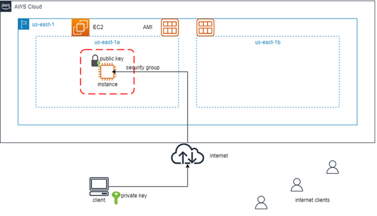
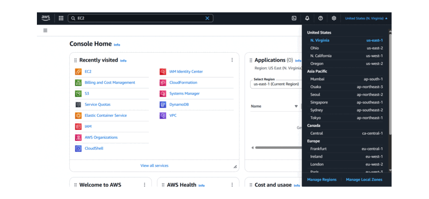
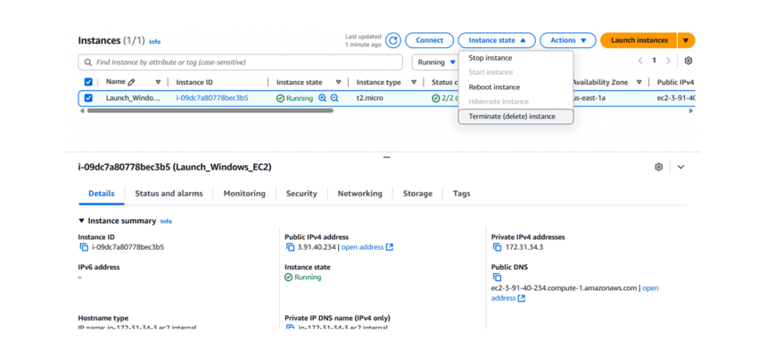

## Introduction

This guide provides a step-by-step walkthrough for launching and connecting to a Windows EC2 instance on AWS. It covers key concepts like EC2 instances, security groups, and key pairs, with a focus on hands-on practice.

## Prerequisites

Before starting, ensure you have:

- An **AWS account** (Free Tier eligible). **Note:**  If you do not have an AWS account, please use the following document to create one: [Create an AWS Account](https://docs.aws.amazon.com/accounts/latest/reference/manage-acct-creating.html).
- A **Windows machine** with **Remote Desktop Connection (RDP)** installed.
- Basic familiarity with **AWS Management Console**.

## AWS Services & Concepts Used

### Core Components

- **EC2 (Elastic Compute Cloud):** Virtual servers in the cloud.
- **Instance:** A virtual machine (VM) with configurable CPU, memory, and storage.
- **Instance Type:** Defines hardware specs (e.g., `t2.micro` = 1 vCPU, 1GB RAM).
- **Amazon Machine Image (AMI):** Pre-configured OS/template for instances.
- **Security Group:** Virtual firewall controlling inbound/outbound traffic.
- **Key Pair:** SSH/RDP authentication keys (public key on AWS, private key locally).

### Key Notes

> ⚠️ **Security Warning:** Allowing RDP from `0.0.0.0/0` is for demo purposes only. In production, restrict access to specific IPs or use a VPN.

---

## Architecture Diagram

*Diagram: EC2 Windows Instance Launch Workflow*

---

## Step-by-Step Lab

### 1. Log in and Select Region

1. Log in to the [AWS Management Console](https://aws.amazon.com/console/).
2. Select the `us-east-1` (N. Virginia) region.
3. Navigate to **EC2 Dashboard** via the search bar.

### 2. Launch Instance

1. Click **"Launch Instance"**.
2. Configure the instance:
   - **Name:** `Launch_Windows_EC2`
   - **Application and OS Images:** `Windows`
   - **AMI:** `Microsoft Windows Server 2022 Base`
   - **Instance Type:** `t2.micro` (Free Tier eligible).

### 3. Create Key Pair

1. Under **"Key Pair"**, select **"Create new key pair"**.

2. Name: `Windows_Key_Pair`

3. Download the `.pem` file and store it securely.
   
   > ⚠️ **Important:** Never share your private key file.

### 4. Configure Network Settings

1. Click **"Edit"** under **Network Settings**.
2. Configure:
   - **VPC:** Default (or custom if required).
   - **Subnet:** Select a subnet (e.g., `us-east-1a`).
   - **Security Group:** Create new:
     - **Name:** `Windows_Security_Group`
     - **Inbound Rule:** Allow **RDP (Port 3389)** from `0.0.0.0/0` (demo only).

### 5.  Advanced details

       1. Credit specification: `Standard`

### 6. Launch and Monitor Instance

1. **Number of instances :** `1`
2. Click **"Launch Instance"**.
3. Wait for the instance state to show **"Running"** and status checks to pass (**2/2 checks**).

---

## Connecting to the Instance (RDP)

### 1. Retrieve Public IP/DNS

- Note the **Public IPv4 address** or **Public IPv4 DNS** from the EC2 dashboard.

### 2. Decrypt Windows Password

1. Select the instance → Click **"Connect"**.
2. Choose the **"RDP client"** tab.
3. Click **"Get Password"** → Upload the `.pem` private key file which was donwloaded in **"Create Key Pair"** step and click on Decrypt password.
4. Copy the decrypted **Administrator password**.

### 3. Connect via RDP

1. Open **Remote Desktop Connection** on your local machine.
2. Enter the **Public DNS/IP** and log in with:
   - **Username:** `Administrator`
   - **Password:** (Decrypted password from Step 2).

---

## Verification

- **Success Criteria:**
  
  - Instance status checks show **2/2 passed**.
  - RDP connection established.

- **AWS EC2 Launch and RDP Connection GIF**
  
  
  
  *GIF: Successful RDP connection to Windows EC2 instance.*

---

## Clean Up

To avoid unnecessary charges:

1. Navigate to **EC2 Instances**.

2. Select `Launch_Windows_EC2` → **Instance State** → **Terminate**.

3. Confirm termination.
   
   > ⚠️ **Cost Warning:** Always terminate unused instances. Security groups and key pairs do not incur costs but should be cleaned up for best practice.

    4. **AWS EC2 Termination GIF:**

*GIF: Successful RDP connection to Windows EC2 instance.       

---

## Key Learnings

- **Provisioning:** Launched a Windows EC2 instance with custom configurations.
- **Security:** Configured security groups to control RDP access.
- **Authentication:** Used key pairs to securely retrieve the Windows password.

---

## Common Issues & Troubleshooting

- "**Issue:** Instance status shows as 'Initializing' and Connect button is disabled"
  
  - "**Possible Cause:** The instance has not fully booted or completed its system checks. **Fix:** Wait a few minutes and refresh the EC2 instance list. Ensure both 'System status checks' and 'Instance status checks' show '2/2 passed or 3/3 passed' before attempting to connect." 

- "**Issue:** Cannot connect via RDP."
  
  - "**Possible Cause:** The inbound RDP rule (port 3389) might be missing or incorrectly configured in the Security Group. **Fix:** Ensure the Security Group associated with your instance allows inbound traffic on TCP port 3389, ideally restricted to your IP address, or `0.0.0.0/0` for initial testing as shown in Step 4."

- "**Issue:** Password decryption fails when retrieving the initial password."
  
  - "**Possible Cause:** The incorrect private key file (`.pem`) was uploaded. **Fix:** Make sure you are uploading the *exact* `.pem` file that you downloaded and associated with this specific instance during the key pair creation step."

- **Issue:** The launch of a T2 instance may fail, especially on new AWS Free Tier accounts, if the Credit specification is set to 'Unlimited'.
  
  - "**Possible Cause:** AWS often restricts 'Unlimited' mode initially to prevent unexpected charges from extended CPU bursts".**Fix:** Under Advanced details, configure the Credit specification as 'Standard'. This prevents extra costs and ensures a successful launch within the Free Tier.

## Next Steps

#### **Configuration and Management**

- Deploy a web server (e.g., IIS) on your Windows instance and configure your Security Group to allow HTTP (Port 80) traffic.
- Learn how to attach an [Elastic IP address](https://docs.aws.amazon.com/AWSEC2/latest/UserGuide/elastic-ip-addresses-eip.html) so the instance maintains the same IP even after stopping and starting.

#### **Automation (Infrastructure as Code)**

- Learn to launch this same instance using the [AWS CLI](https://awscli.amazonaws.com/v2/documentation/api/latest/reference/ec2/run-instances.html).
- Explore [Terraform](https://developer.hashicorp.com/terraform/docs) or [AWS CloudFormation](https://docs.aws.amazon.com/AWSCloudFormation/latest/UserGuide/Welcome.html) *to automate infrastructure deployment using Infrastructure as Code (IaC) for advanced automation workflows*.

#### **Security and Best Practices**

- Review [AWS IAM Roles](https://docs.aws.amazon.com/IAM/latest/UserGuide/id_roles.html) and learn how to assign permissions to the EC2 instance securely, rather than storing access keys on the server.

#### **Learn More**

- [AWS EC2 Windows Documentation](https://docs.aws.amazon.com/AWSEC2/latest/WindowsGuide/)
- [AWS Well-Architected Framework](https://aws.amazon.com/architecture/well-architected/)

## References

- AWS Free Tier: [AWS Free Tier](https://aws.amazon.com/free/)
- EC2 User Guide: [EC2 User Guide](https://docs.aws.amazon.com/AWSEC2/latest/UserGuide/concepts.html)
