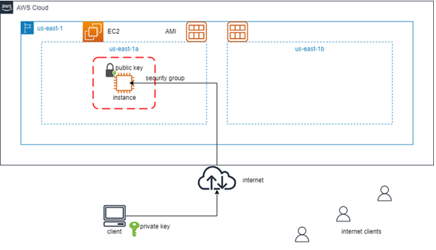
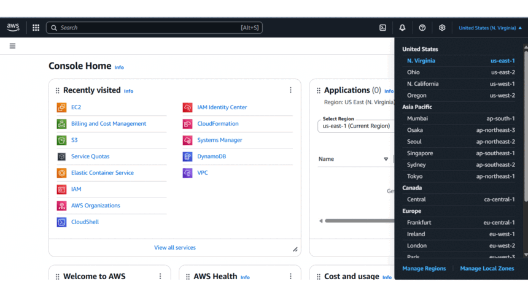
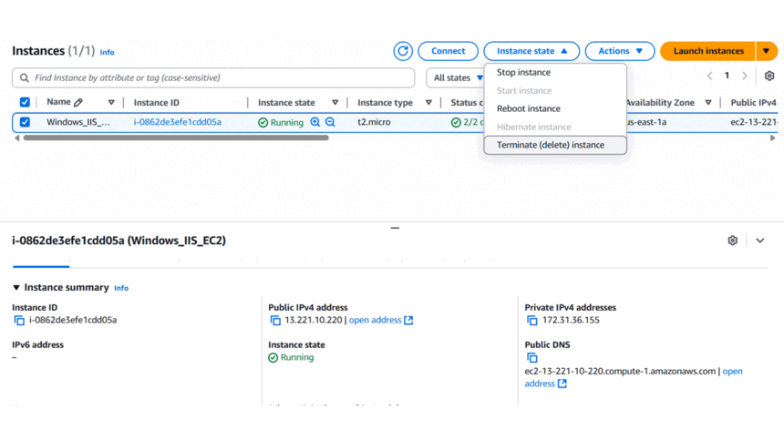

## Configure an EC2 Windows Instance as IIS Web Server

## Introduction

This guide walks you through turning an existing (or newly-launched) Windows EC2 instance into a fully-functional IIS web server. You’ll install Internet Information Services (IIS), deploy the default website, and open HTTP access so the site is reachable from the internet.

## Prerequisites

Before starting, ensure you have:

- An **AWS account** (Free Tier eligible). **Note:** If you do not have an AWS account, please use the following document to create one: [Create an AWS Account](https://docs.aws.amazon.com/accounts/latest/reference/manage-acct-creating.html).
- A **Windows machine** with **Remote Desktop Connection (RDP)** installed.
- Basic familiarity with **AWS Management Console**.

## AWS Services & Concepts Used

### Core Components

- **EC2 (Elastic Compute Cloud):** Virtual servers in the cloud.

- **IIS (Internet Information Services):** Microsoft’s web-server software.

- **Security Group:** Virtual firewall controlling inbound/outbound traffic.

- **Key Pair:** Used to decrypt the Windows Administrator password.
  
  ### Key Notes
  
  > ⚠️ **Security Warning:** Allowing HTTP from `0.0.0.0/0` is acceptable for this lab. In production, restrict access to specific IPs or place a load balancer/WAF in front.

---

## Architecture Diagram

*Diagram: EC2 Windows Instance Launch Workflow*

---

## Step-by-Step Lab

### 1. Log in and Select Region

1. Log in to the [AWS Management Console](https://aws.amazon.com/console/).

2. Select the `us-east-1` (N. Virginia) region.

3. Navigate to **EC2 Dashboard** via the search bar.

### 2. Launch Instance (if needed)

Click **"Launch Instance"**.

Configure the instance:

1. **Name:** `Windows_IIS_EC2`

2. **Application and OS Images:** `Windows`

3. **AMI:** `Microsoft Windows Server 2022 Base`

4. **Instance Type:** `t2.micro` (Free Tier eligible).

### 3. Key Pair

1. Under **"Key Pair"**, select an **existing key pair** (or create a new one and download the `.pem` file). if you wish to create a new key pair, please refer to this [link](https://www.github.com/cloudforce01/aws-cloud-projects/tree/main/01-launch-ec2/01-launch-ec2.md#3-create-key-pair)

### 4. Configure Network Settings

Click **"Edit"** under **Network Settings**.

Configure:

- **VPC:** Default (or custom if required).

- **Subnet:** Any subnet in `us-east-1a` (or leave default).

- **Security Group:** Select an **existing** security group (we’ll edit the rules later), or if you wish to create a new security group, please refer to this [link](https://www.github.com/cloudforce01/aws-cloud-projects/tree/main/01-launch-ec2/01-launch-ec2.md#4-configure-network-settings)

### 5. Launch and Monitor Instance

1. **Number of instances:** `1`

2. Click **"Launch Instance"**.

Wait for:

- **Instance State:** `Running`
- **Status Checks:** `2/2 passed or 3/3 passed`

---

## Connecting to the Instance (RDP)

### 1. Retrieve Public IP/DNS

- Note the **Public IPv4 address** or **Public IPv4 DNS** from the EC2 dashboard.

### 2. Decrypt Windows Password

1. Select the instance → Click **"Connect"**.

2. Choose the **"RDP client"** tab.

3. Click **"Get Password"** → Upload the `.pem` private key file and click **Decrypt Password**.

4. Copy the decrypted **Administrator password**.

### 3. Connect via RDP

Open **Remote Desktop Connection** on your local machine.

Input the Public DNS/IP and log in, or copy the Public DNS/IP from the 'RDP client' tab, paste it into the computer field in the local RDP connection, and then log in.

- **Username:** `Administrator`
- **Password:** (Decrypted password from Step 2).

---

## Configuring IIS Web Server

### 1. Open Server Manager

1. Click **Start** → **Server Manager**.

2. Wait a few seconds for it to load.

### 2. Add Roles and Features

1. Click **"Add roles and features"**.

2. **Installation Type:**
- Select **"Role-based or feature-based installation"** → **Next**.
3. **Server Selection:**
- Leave defaults → **Next**.
4. **Server Roles:**
- Check **"Web Server (IIS)"** → Click **"Add Features"** → **Next**.
5. **Features:**
- Leave defaults → **Next**.
6. **Web Server Role (IIS):**
- Click **Next**.
7. **Role Services:**
- Leave defaults → **Next**.
8. **Confirmation:**
- Click **Install**.
  
  > **Default website path:** `C:\inetpub\wwwroot`

---

## Allow HTTP in Security Group

1. In the EC2 console, select the instance → **Security** → **Security groups**.
2. Click **"Edit inbound rules"**.
3. Click **"Add rule"**:
   - **Type:** `HTTP`
   - **Source:** `0.0.0.0/0` (Anywhere IPv4)
4. Click **"Save rules"**.

---

## Try Accessing Webpage

1. From your local browser, navigate to: `http://<Public-IPv4-DNS-or-IP>` **Note:** Replace the placeholder `<Public-IPv4-DNS-or-IP>` with your instance's actual public IP address or public IPv4 DNS, without including the angle brackets.
2. You should see the **IIS Welcome Page**.

---

## Verification

- **Success Criteria:**
  
  - IIS installed successfully.
  - Default IIS page loads in a browser.

- **AWS EC2 Launch, RDP Connection and Configuring IIS GIF**
  
  
  
  *GIF: Successful RDP connection to Windows EC2 instance.*

---

## Clean Up

To avoid unnecessary charges:

1. Navigate to **EC2 Instances**.

2. Select `Windows_IIS_EC2` → **Instance State** → **Terminate**.

3. Confirm termination.
   
   > ⚠️ **Cost Warning:** Always terminate unused instances. Security groups and key pairs do not incur costs but should be cleaned up for best practice.

    4. **AWS EC2 Termination GIF:**

*GIF: EC2 instance termination.*       

---

## Key Learnings

- **Installation:** Added the IIS role to a Windows EC2 instance.
- **Security:** Updated security group rules to allow HTTP traffic.
- **Validation:** Verified the web server is publicly accessible.

---

## Common Issues & Troubleshooting

- **Issue:** Cannot reach the IIS page in a browser.
  
  -  **Possible Cause:** HTTP inbound rule missing or mis-configured in the Security Group. **Fix:** Ensure the Security Group allows inbound TCP port 80 from     `0.0.0.0/0` (or your IP).

- **Issue:** Server Manager does not open or hangs.
  
  - **Possible Cause:** Instance still initializing or low CPU credits. **Fix:** Wait until status checks are `2/2 passed` and CPU utilization is stable.

- **Issue:** RDP connection drops during IIS installation.
  
  - **Possible Cause:** Network interruption or Windows reboot after role installation. **Fix:** Reconnect via RDP; installation continues automatically.

- **Issue:** Browser shows ‘This site can’t be reached’.
  
  - **Possible Cause:** Windows Firewall on the instance is blocking port 80. **Fix:** Inside the instance, open Windows Defender Firewall → Allow an app → Ensure ‘World Wide Web Services (HTTP Traffic-In)’ is enabled.

## Next Steps

### Configuration and Management

Replace the default IIS page with your own HTML/PHP content in `C:\inetpub\wwwroot`

Attach an **Elastic IP** so the instance keeps the same public IP after stop/start.

### Automation (Infrastructure as Code)

Automate IIS installation with **EC2 User Data** scripts or **AWS Systems Manager**.

Explore **Terraform** or **AWS CloudFormation** to provision the entire stack (EC2 + Security Group + IIS bootstrap).

### Security and Best Practices

Use **AWS Certificate Manager** and **Application Load Balancer** to serve HTTPS.

Review **IAM roles** for S3 access if you plan to host static assets off-instance.

### Learn More

[IIS Documentation](https://learn.microsoft.com/iis)

[AWS for Windows Server](https://aws.amazon.com/microsoft/windows-server/)

## References

AWS Free Tier: [AWS Free Tier](https://aws.amazon.com/free/)

EC2 User Guide: [EC2 User Guide](https://docs.aws.amazon.com/AWSEC2/latest/UserGuide/concepts.html)
